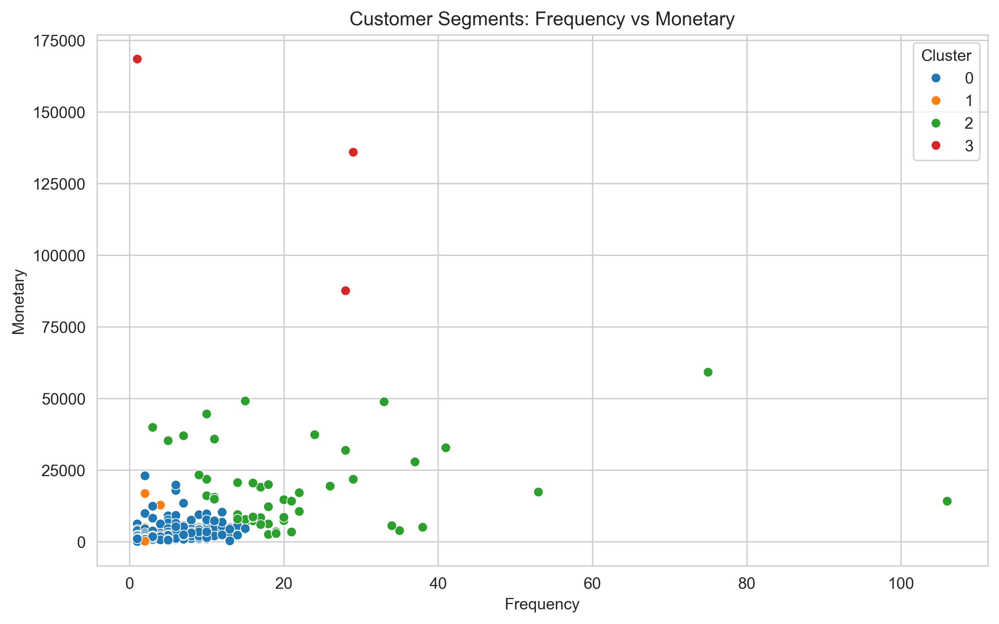
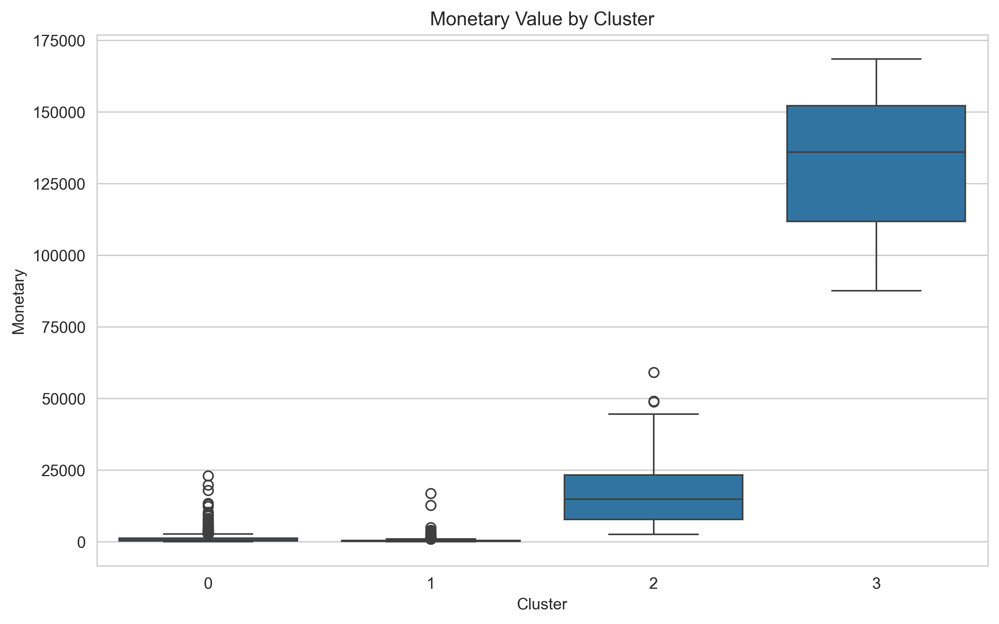

# 🛍️ E-Commerce Customer Segmentation & Churn Analysis

## 📌 Project Overview
This project analyzes customer transaction data to identify customer segments, predict churn, and understand revenue patterns.

---

## 📊 Key Features
- Customer segmentation using KMeans clustering
- Churn prediction using Machine Learning
- Revenue analysis using RFM model
- Data visualization for business insights

---

## 📁 Dataset
Online Retail Dataset (UCI / Kaggle)

---

## 📈 Visualizations

### Customer Segments

### Recency by Cluster

### Monetary by Cluster

---

## 🔍 Results
- Identified high-value (VIP) customers
- Detected churn-risk customers
- Recency is the most important factor for churn

---

## 🛠️ Tools Used
- Python
- Pandas
- Scikit-learn
- Matplotlib / Seaborn

---

## 👨‍💻 Author
Neel Mendapara
